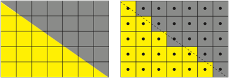

CUDA Path Tracer
================

**University of Pennsylvania, CIS 5650: GPU Programming and Architecture, Project 3**

* Michael Rabbitz
  * [LinkedIn](https://www.linkedin.com/in/mike-rabbitz)
* Tested on: Windows 10, i7-9750H @ 2.60GHz 32GB, RTX 2060 6GB (Personal)

***Insert coolest demo image(s) here***

## Part 1: Introduction

This project takes an incomplete skeleton of a C++/CUDA path tracer, transforms it to a functional state by implementing core features, then enhances it by implementing physically-based visual improvements, mesh enhancements, and performance optimizations.

### Path Tracing Overview
Path tracing is a sophisticated rendering technique in computer graphics designed to achieve photorealistic images by accurately simulating the behavior of light in a scene. This technique flips the conventional perspective on light: instead of light traveling from sources to the eye, rays are cast from the camera into the scene, exploring how light interacts with the surfaces of objects in the scene and determining how those surfaces are illuminated. The Bidirectional Scattering Distribution Function (BSDF) plays a key role in this process, governing how light scatters when it hits a surface, accounting for both reflection and refraction.

As rays bounce off surfaces, they generate multiple reflections and/or refractions until they reach a light source or exit the scene. Path tracing employs Monte Carlo integration to estimate pixel colors by averaging many random samples, enhancing image quality at the cost of increased rendering time. A standout feature of path tracing is its ability to simulate global illumination, capturing the complex interplay of light as it bounces between surfaces. While it delivers high-quality results and effectively handles various materials and lighting conditions, path tracing can be computationally demanding and may introduce noise, which can be mitigated by increasing the sample count.

|Global Illumination = Direct Illumination + Indirect Illumination|
|:--:|
| <tr></tr>|
|*Left: Light Ray* ***directly*** *illuminating the point on the floor from the viewer's perspective via no intermediate bounce(s)* <tr></tr>|
|*Right: Light Ray* ***indirectly*** *illuminating the point on the floor from the viewer's perspective via an intermediate bounce*|

|BSDF = BRDF + BTDF|
|:--:|
| <tr></tr>|
|[Source](https://en.wikipedia.org/wiki/Bidirectional_scattering_distribution_function)|

|"Scattering" in Path Tracing using BSDFs|
|:--:|
| <tr></tr>|
|This series illustrates a single ray cast from the eye in path tracing (yellow ray) as it focuses on a point on the floor. It demonstrates how global illumination at that point is achieved through multiple bounces of the ray, interacting with surfaces based on their BSDFs. Each bounce scatters additional rays according to the surface's BSDF, creating many ray paths. The contribution to the illumination of the initial point decreases with each bounce and ultimately concludes when all ray paths either hit a light source, exit the scene, or reach the bounce/depth limit.|

## Part 2: Core Features Implemented

### Ideal Diffuse (Lambertian) BSDF Evaluation
Ideal Diffuse (Lambertian) BSDF evaluation models perfectly diffuse surfaces that scatter light uniformly in all directions. The amount of light reflected is proportional to the cosine of the angle between the incoming light direction and the surface normal, following Lambert's cosine law. As a result, light is scattered more strongly in directions closer to the surface normal. In this path tracer, the evaluation is computed by randomly sampling directions in a hemisphere around the surface normal, with a cosine-weighted bias for more accurate light contribution.

|Lambertian Reflectance|
|:--:|
| <tr></tr>|
|[Source](https://en.wikipedia.org/wiki/Lambertian_reflectance)|

***Insert cool demo image(s) here***

### Perfect Specular Reflection (Mirrored) BSDF Evaluation
Perfect Specular Reflection (Mirrored) BSDF evaluation models surfaces that reflect light in a single, mirror-like direction. Incoming light rays are reflected at an angle equal to the incident angle relative to the surface normal, creating sharp reflections without any scattering. In this path tracer, the reflection is computed by reflecting the incoming ray about the surface normal, effectively simulating the behavior of ideal mirrors.

|Mirrored Reflectance|
|:--:|
| <tr></tr>|
|[Source](https://en.wikipedia.org/wiki/Specular_reflection)|

***Insert cool demo image(s) here***

### Stochastic Sampled Antialiasing
|Shooting a ray in the center of each pixel|
|:--:|
| <tr></tr>|
|The ray either hits yellow or gray. The pixel gets the associated color, leading to an image with jagged edges. <tr></tr>|
|[Source](https://community.sap.com/t5/application-development-blog-posts/abap-ray-tracer-part-5-the-sample/ba-p/13338277)|

|Shooting multiple rays in the space of a single pixel (the top-left pixel in above image)|
|:--:|
| <tr></tr>|
|This example shows 25 ray samples taken for a single pixel, where each sample either returns yellow or gray. The color is averaged over all samples taken. <tr></tr>|
|[Source](https://community.sap.com/t5/application-development-blog-posts/abap-ray-tracer-part-5-the-sample/ba-p/13338277)|

***Insert cool demo image(s) here***

### Path Continuation/Termination using Stream Compaction
In the path tracer implementation, Path Continuation/Termination is handled using stream compaction with [thrust::stable_partition](https://nvidia.github.io/cccl/thrust/api/function_group__partitioning_1ga12fbf51ebfc80fd049ed0cbde2dd8ff8.html).
During each iteration, rays (or path segments) are traced through the scene, and after each bounce, path segments that have not yet terminated are compacted in memory to improve computational efficiency. Path segments that either hit light sources or escape the scene (without hitting any objects) are removed from the pool of active path segments.

This use of stream compaction reduces wasted computation on terminated segments and makes more efficient use of GPU resources. By focusing only on active path segments, the path tracer optimizes workload distribution, ensuring that only relevant segments contribute to the image. This approach enhances the scalability and efficiency of the path tracer, especially in complex scenes or deep bounce scenarios.

### Path Segments contiguous in memory by Material before BSDF Evaluation and Shading
Sorting path segments by material before BSDF evaluation helps improve memory coherence and efficiency during shading by grouping similar materials together. This allows the path tracer to batch shading operations, reducing divergence in GPU kernels, especially in scenes with many different materials. When path segments are contiguous in memory by material, similar shading tasks (e.g., diffuse, reflective, or refractive) are processed more efficiently.

However, this sorting step can introduce overhead in simpler scenes with few materials, where the cost of sorting outweighs the benefits. In such cases, sorting adds computational expense without significantly improving performance, leading to slower runtimes. The advantage of sorting is most noticeable in complex scenes with a diverse range of materials.

***Insert performance analysis chart here of runtime of scenes of many materials and few materials***

## Part 3: Physically-based Visual Improvements

### Dielectric BSDF Evaulation (Refraction, Fresnel effects)

### Metal BSDF Evaulation (Roughness, Fresnel effects)

## Part 4: Mesh Enhancements

### OBJ Loader and Renderer (Ray-Triangle Intersection)

## Part 5: Performance Optimizations

### Bounding Volume Hierarchy (BVH)
**Construction uses the Surface Area Hueristic (SAH) for Axis-Aligned Bounding Box (AABB) subdivision**

