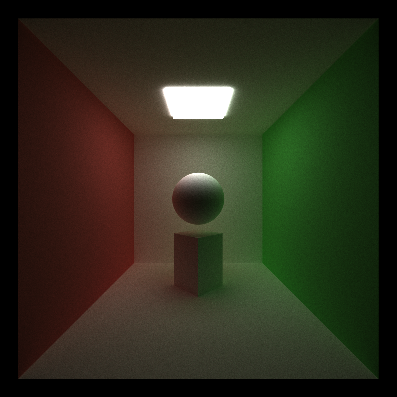

CUDA Path Tracer
================

**University of Pennsylvania, CIS 5650: GPU Programming and Architecture, Project 3**

* Michael Rabbitz
  * [LinkedIn](https://www.linkedin.com/in/mike-rabbitz)
* Tested on: Windows 10, i7-9750H @ 2.60GHz 32GB, RTX 2060 6GB (Personal)

***Insert coolest demo image(s) here***

## Part 1: Introduction

This project takes an incomplete skeleton of a C++/CUDA path tracer, transforms it to a functional state by implementing core features, then enhances it by implementing physically-based visual improvements, mesh enhancements, and performance optimizations.

### Path Tracing Overview
Path tracing is a sophisticated rendering technique in computer graphics designed to achieve photorealistic images by accurately simulating the behavior of light in a scene. This technique flips the conventional perspective on light: instead of light traveling from sources to the eye, rays are cast from the camera into the scene, exploring how light interacts with the surfaces of objects in the scene and determining how those surfaces are illuminated. The Bidirectional Scattering Distribution Function (BSDF) plays a key role in this process, governing how light scatters when it hits a surface, accounting for both reflection and refraction.

As rays bounce off surfaces, they generate multiple reflections and/or refractions until they reach a light source or exit the scene. Path tracing employs Monte Carlo integration to estimate pixel colors by averaging many random samples, enhancing image quality at the cost of increased rendering time. A standout feature of path tracing is its ability to simulate global illumination, capturing the complex interplay of light as it bounces between surfaces. While it delivers high-quality results and effectively handles various materials and lighting conditions, path tracing can be computationally demanding and may introduce noise, which can be mitigated by increasing the sample count.

|Global Illumination = Direct Illumination + Indirect Illumination|
|:--:|
| <tr></tr>|
|*Left: Light Ray* ***directly*** *illuminating the point on the floor from the viewer's perspective via no intermediate bounce(s)* <tr></tr>|
|*Right: Light Ray* ***indirectly*** *illuminating the point on the floor from the viewer's perspective via an intermediate bounce*|

|Bidirectional Scattering Distribution Function (BSDF)|
|:--:|
| <tr></tr>|
|A BSDF is a mathematical model that describes how light is scattered when it interacts with a surface. It provides a way to characterize the reflection and transmission of light at a surface by specifying how incoming light is redistributed into outgoing directions. The BSDF can be divided into two components: the Bidirectional Reflectance Distribution Function (BRDF), which describes reflection, and the Bidirectional Transmittance Distribution Function (BTDF), which describes transmission. BSDFs are essential in rendering and computer graphics, as they help simulate realistic materials and lighting interactions, contributing to the overall realism of rendered images. <tr></tr>|
|[Image Source](https://en.wikipedia.org/wiki/Bidirectional_scattering_distribution_function)|

|"Scattering" in Path Tracing using BSDFs|
|:--:|
| <tr></tr>|
|This series illustrates a single ray cast from the eye in path tracing (yellow ray) as it focuses on a point on the floor. It demonstrates how global illumination at that point is achieved through multiple bounces of the ray, interacting with surfaces based on their BSDFs. Each bounce scatters additional rays according to the surface's BSDF, creating many ray paths. The contribution to the illumination of the initial point decreases with each bounce and ultimately concludes when all ray paths either hit a light source, exit the scene, or reach the bounce/depth limit.|

## Part 2: Core Features

### Ideal Diffuse BSDF Evaluation
Ideal Diffuse (Lambertian) BSDF evaluation models perfectly diffuse surfaces that scatter light uniformly in all directions. The amount of light reflected is proportional to the cosine of the angle between the incoming light direction and the surface normal, following Lambert's cosine law. As a result, light is scattered more strongly in directions closer to the surface normal. In this path tracer, the evaluation is computed by randomly sampling directions in a hemisphere around the surface normal, with a cosine-weighted bias for more accurate light contribution.

|Lambertian Reflectance|
|:--:|
| <tr></tr>|
|[Image Source](https://en.wikipedia.org/wiki/Lambertian_reflectance)|

|All objects besides the light have diffuse surface materials|
|:--:|
||

### Perfect Specular Reflection BSDF Evaluation
Perfect Specular Reflection (Mirrored) BSDF evaluation models surfaces that reflect light in a single, mirror-like direction. Incoming light rays are reflected at an angle equal to the incident angle relative to the surface normal, creating sharp reflections without any scattering. In this path tracer, the reflection is computed by reflecting the incoming ray about the surface normal, effectively simulating the behavior of ideal mirrors.

|Mirrored Reflectance|
|:--:|
| <tr></tr>|
|[Image Source](https://en.wikipedia.org/wiki/Specular_reflection)|

|Sphere + Cuboid are Perfect Specular|Floor is Perfect Specular|
|:--:|:--:|
|||

### Stochastic Sampled Antialiasing
Stochastic Sampled Antialiasing enhances the visual quality of rendered images by reducing aliasing artifacts through jittering ray directions within a single pixel. In this implementation, rays are generated from the camera's position and directed toward the scene, incorporating a random offset to the pixel coordinates. When stochastic sampling is enabled, each ray is slightly perturbed within the pixel range, creating a more varied sampling pattern. This randomization averages out pixel colors over multiple samples, resulting in smoother transitions and improved image fidelity.

|Antialising OFF - Shooting a ray in the center of each pixel|
|:--:|
| <tr></tr>|
|The ray either hits yellow or gray. The pixel gets the associated color, leading to an image with jagged edges. <tr></tr>|
|[Image Source](https://community.sap.com/t5/application-development-blog-posts/abap-ray-tracer-part-5-the-sample/ba-p/13338277)|

|Antialiasing ON - Shooting multiple rays in the space of a single pixel|
|:--:|
|In this graphic, we are referring to the top-left pixel in the above image <tr></tr>|
| <tr></tr>|
|This example shows 25 ray samples taken for a single pixel, where each sample either returns yellow or gray. The color is averaged over all samples taken. <tr></tr>|
|[Image Source](https://community.sap.com/t5/application-development-blog-posts/abap-ray-tracer-part-5-the-sample/ba-p/13338277)|

|Antialising OFF - Sharp corners|
|:--:|
||

|Antialiasing ON - Sharp corners|
|:--:|
||

### Path Continuation/Termination using Stream Compaction
In the path tracer implementation, Path Continuation/Termination is handled using stream compaction with [thrust::stable_partition](https://nvidia.github.io/cccl/thrust/api/function_group__partitioning_1ga12fbf51ebfc80fd049ed0cbde2dd8ff8.html).
During each iteration, rays (or path segments) are traced through the scene, and after each bounce, path segments that have not yet terminated are compacted in memory to improve computational efficiency. Path segments that either hit light sources or escape the scene (without hitting any objects) are removed from the pool of active path segments.

This use of stream compaction reduces wasted computation on terminated segments and makes more efficient use of GPU resources. By focusing only on active path segments, the path tracer optimizes workload distribution, ensuring that only relevant segments contribute to the image. This approach enhances the scalability and efficiency of the path tracer, especially in complex scenes or deep bounce scenarios.

***Insert performance analysis chart here of runtime of scenes of many non-hit rays vs many hit rays***

### Path Segments contiguous in memory by Material before BSDF Evaluation and Shading
Sorting path segments by material before BSDF evaluation helps improve memory coherence and efficiency during shading by grouping similar materials together. This allows the path tracer to batch shading operations, reducing divergence in GPU kernels, especially in scenes with many different materials. When path segments are contiguous in memory by material, similar shading tasks (e.g., diffuse, reflective, or refractive) are processed more efficiently.

However, this sorting step can introduce overhead in simpler scenes with few materials, where the cost of sorting outweighs the benefits. In such cases, sorting adds computational expense without significantly improving performance, leading to slower runtimes. The advantage of sorting is most noticeable in complex scenes with a diverse range of materials.

***Insert performance analysis chart here of runtime of scenes of many materials and few materials***

## Part 3: Physically-based Visual Improvements

### Dielectric BSDF Evaulation
Dielectric BSDF Evaluation models the behavior of materials that exhibit both reflective and refractive properties, such as glass or water. In this implementation, the evaluation begins by determining the index of refraction based on whether the incoming ray hits the front or back face of the surface. Using Snell's Law, the algorithm computes the direction of the refracted ray, while also considering Fresnel effects, which dictate that some portion of the incoming light will be reflected. If total internal reflection occurs, the ray is reflected instead of refracted. This approach allows for a realistic simulation of light interactions at boundaries, capturing the subtleties of refraction and reflection based on the angle of incidence and the material's properties.

|Glass Cuboids|Glass Sphere|
|:--:|:--:|
|||

### Metal BSDF Evaulation
Metal BSDF evaluation models the unique reflective properties of metallic surfaces, capturing both roughness and Fresnel effects. When light hits a metal surface, it is primarily reflected, but some light can scatter into the material, causing absorption. This scattering can lead to softer highlights and reduced overall brightness. The evaluation takes into account the angle of incidence and the roughness of the surface to create realistic reflections. As a result, this approach achieves a more accurate representation of metals, balancing their shiny appearance with the subtle dimming effects from light absorption.

|Gold Colored|
|:--:||:--:|:--:|
|Rough|Rougher|Roughest|
|:--:|:--:|:--:|
||||

## Part 4: Mesh Enhancements

### OBJ Loading and Rendering
OBJ Loading and Rendering enables the loading and rendering of 3D models from OBJ files. It uses the [tinyObj](https://github.com/syoyo/tinyobjloader) library to parse the OBJ file, extracting material and geometry data, including vertices and normals. The extracted material data are categorized into types such as dielectrics, metals, diffuse materials, and light-emitting materials.

The renderer implements the [Möller–Trumbore intersection algorithm](https://www.scratchapixel.com/lessons/3d-basic-rendering/ray-tracing-rendering-a-triangle/moller-trumbore-ray-triangle-intersection.html) to test whether a ray intersects with a triangle in the scene. This algorithm uses barycentric coordinates to determine the intersection point and calculates the surface normal.

***Insert cool demo image(s) here***

## Part 5: Performance Optimizations

### Bounding Volume Hierarchy (BVH)
[Reference 1](https://jacco.ompf2.com/2022/04/13/how-to-build-a-bvh-part-1-basics/)
[Reference 2](https://jacco.ompf2.com/2022/04/18/how-to-build-a-bvh-part-2-faster-rays/)

The Bounding Volume Hierarchy (BVH) implementation utilizes the Surface Area Heuristic (SAH) to efficiently build a hierarchical structure for 3D geometries, which significantly enhances ray intersection performance. Each geometry is encapsulated within an Axis-Aligned Bounding Box (AABB), calculated for various shapes such as triangles, cubes, and spheres. The BVH nodes store the AABBs and reference the geometries, while the subdivision process intelligently partitions the geometries based on their centroids. The SAH optimizes this subdivision by evaluating potential split positions and axes to minimize the expected cost of ray-object intersection tests, effectively balancing the number of rays and objects in each node.

This hierarchical organization allows the BVH to reduce the number of geometry checks during ray tracing. The algorithm first tests for intersections with the bounding boxes of BVH nodes, enabling early exits if a node is not hit. If a leaf node is reached, it checks for intersections with the individual geometries it contains. This efficient approach to spatial data organization results in faster rendering times in graphics applications, making it ideal for complex scenes with numerous geometries.

***Insert performance analysis chart here of runtime of scenes with and without BVH***

